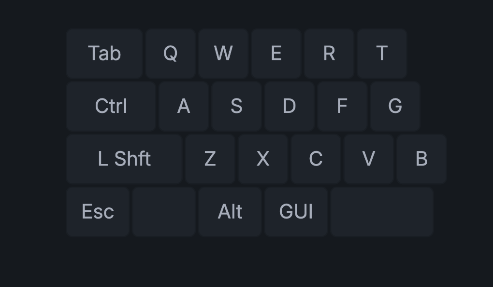
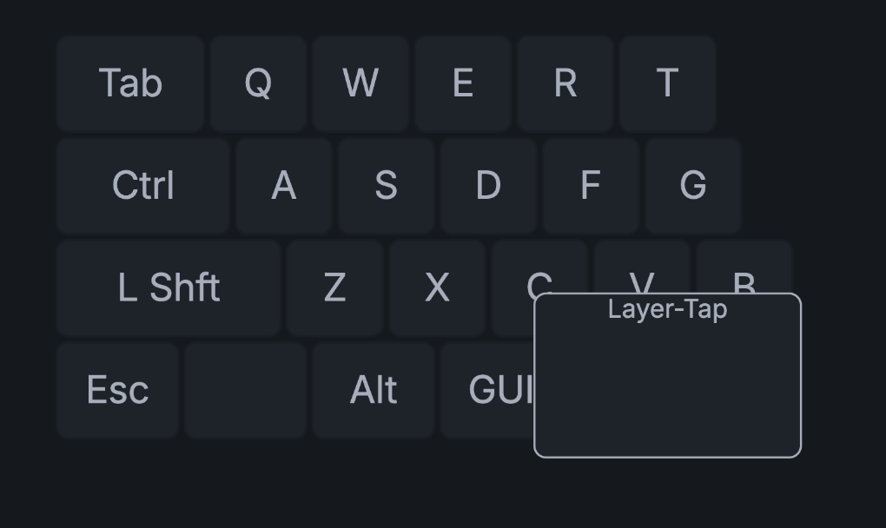
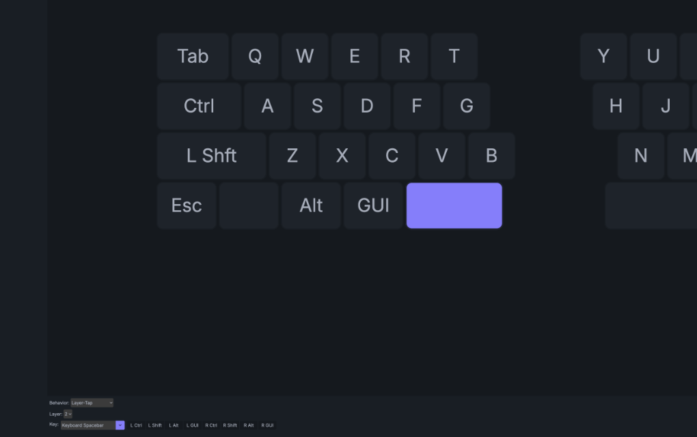
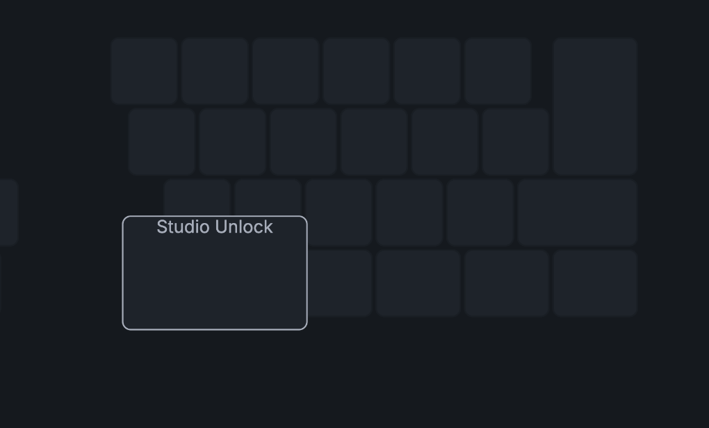
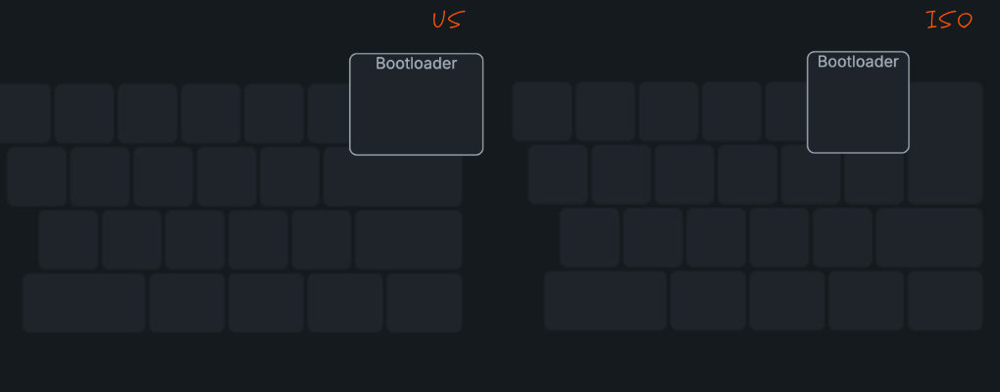

# Loofie FocusGrow — キーマップガイド

キーマップガイドはファームウェアの書き込みが完了している前提で進めます。  
- 書き込みがまだの場合は先に[本体組み立てガイド](build-guide.md)を参照してください。  
- Ready Kitは書き込んだ状態で同梱しているのでファームウェアの書き込みは不要です。  
  - 書き込まれているファームウェアはUSエンター版となります。ISOエンターを採用する場合はファームウェアの書き換えを参照してください。

## PCへの接続

1. USB ケーブル(Type-C)でキーボードと PC を接続します。

## ZMK Studio への接続

### サイトへのアクセス

[ZMK Studio](https://zmk.studio) を開きます。

### シリアルポートへの接続

1. USBをクリック。

   
2. シリアルポートの選択ダイアログが表示されるので、Loofie FGを選択して **接続** をクリック。

   

### System Unlock と初期設定

接続後、キーボード側でロック解除の操作が必要です。
初期キーマップではレイヤー3(システムレイヤー)にstudio_unlockを割り当てています。

1. 接続後に以下の画面となったら

   

2. 1→2→3の順にキーを押すことでロック解除できます。

   

## キーマップの編集

ロックに解除するとキーマップ編集画面に遷移します。左上にあるLayoutよりUS/ISOを選択してください。

   
基本的な操作方法は [ZMK 公式ドキュメント](https://zmk.dev/docs) を参照してください。

## ファームウェアの書き換え

ファームウェアを書き換える場合はマイコンをリセットする必要がありますが、筐体を分解する必要はありません。  
初期設定ではシステムレイヤーのバックスペースに配置していますので、そのキーを素早く2回押していただくことでBoot Loaderモードになります。  
[初期ファームウェアのキーマップ](https://github.com/MogmaProducts/loofie-focusgrow-zmk-config/blob/main/config/LoofieFocusGrow_common.keymap)

ファームウェアの書き換え手順については[ファームウェアの書き込み](./soldering-guide.md)に沿って進めてください。

## キーマップ編集の注意点

### 空白のキーにも割り当てがされているものがある

文字や数字などはZMK Studioでは表示され、割り当てがされているのがわかります。

   

一方で、レイヤー切り替えや特殊キー、Transなどは表示されず、空白のキーのようにみえます。

カーソルを合わせると割り当てが表示されたり、Transということがわかる
   
キーを選択すると下側に割り当て詳細が表示されたり、割り当てを変更できる
   

カーソルを合わせないと割り当てられているキーがわからないのは不便ではありますが、後述するキーの割り当てには注意してください。

### ZMKを使う上で必要なキーについて

Loofieでは以下の2つのキーを使います。初期のキー配置では共にレイヤー3に割り当てています。  
- studio_unlock: ZMK Studioを起動するために必要なキー。押せないとキーマップが編集できなくなる。
- boot Loader: ファームウェアを書き込むために使用するキー。押せないと筐体を分解してマイコンのリセットキーを押すことになる。

この2つのキーは押せなくなるとカスタマイズに支障が出るため、キーマップ変更時には上書きされて押せなくならないよう注意してください。  
必ずしも初期配置でないといけない、ということはないので、これらのキーマップを変更することは問題ありません。

studio_unlockはレイヤー3のこの位置
   
boot loaderはUSとISOで位置が違う
   