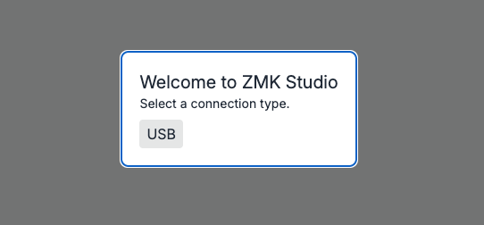
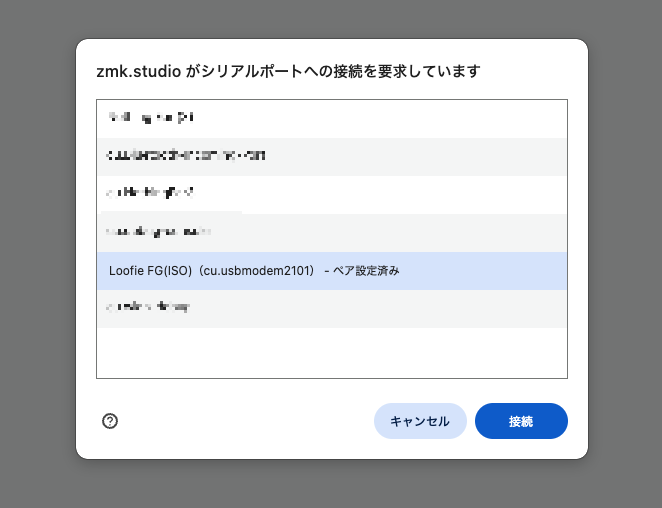
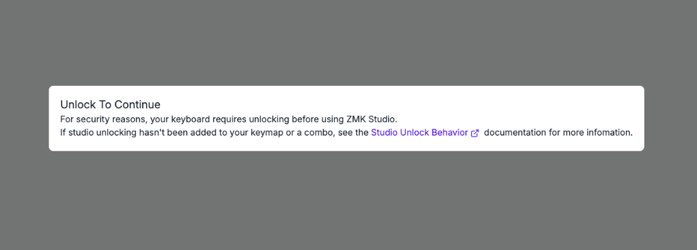
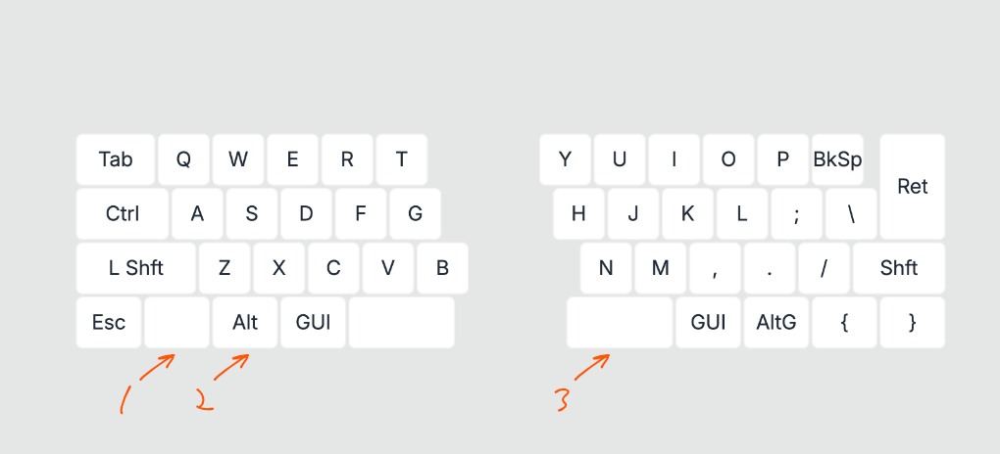
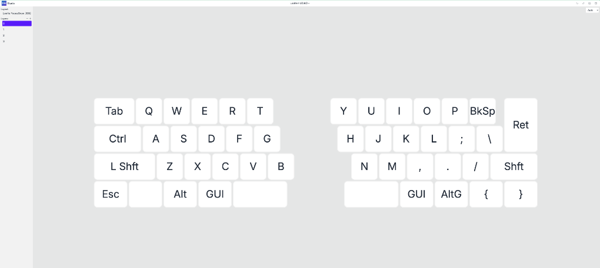

# Loofie FocusGrow — キーマップガイド

ファームウェアの書き込みが完了している前提で進めます。  
書き込みがまだの場合は先に[本体組み立てガイド](build-guide.md)を参照してください。  
Ready Kitは書き込んだ状態で同梱しているのでファームウェアの書き込みは不要です。  

## PCへの接続

1. USB ケーブル(Type-C)でキーボードと PC を接続します。

## ZMK Studio への接続

### サイトへのアクセス

[ZMK Studio](https://zmk.studio) を開きます。

### シリアルポートへの接続

1. USBをクリック。

   
2. シリアルポートの選択ダイアログが表示されるので、Loofie FGを選択して **接続** をクリック。

   

### System Unlock と初期設定

接続後、キーボード側でロック解除の操作が必要です。
初期キーマップではレイヤー3(システムレイヤー)にstudio_unlockを割り当てています。

1. 接続後に以下の画面となったら

   

2. 1→2→3の順にキーを押すことでロック解除できます。

   

## キーマップの編集

ロックに解除するとキーマップ編集画面に遷移します。左上にあるLayoutよりUS/ISOを選択してください。

   
基本的な操作方法は [ZMK 公式ドキュメント](https://zmk.dev/docs) を参照してください。

## ファームウェアの書き換え

ファームウェアを書き換える場合はマイコンをリセットする必要がありますが、筐体を分解する必要はありません。  
初期設定ではシステムレイヤーのバックスペースに配置していますので、そのキーを素早く2回押していただくことでBoot Loaderモードになります。  
[初期ファームウェアのキーマップ](https://github.com/MogmaProducts/loofie-focusgrow-zmk-config/blob/main/config/LoofieFocusGrow_common.keymap)